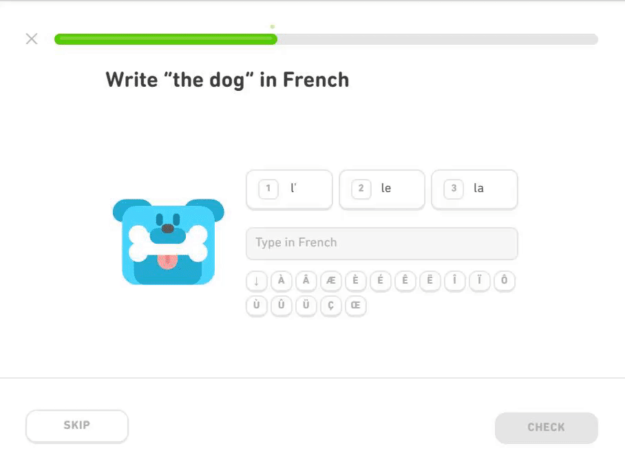

<h1>  DuoLenium </h1>
A tool that maintains your Duolingo streak by automatically completing exercises for you.
 

# Demo

# Usage
Make sure you have a Duolingo account and python 3.6+ installed.
 
`pip install -r requirements.txt`
 
`python main_chrome.py`
 
Enter your email and password for the Duolingo website. It will log you in and automatically complete a training exercise so that you can maintain your streak 🔥 with ease.
